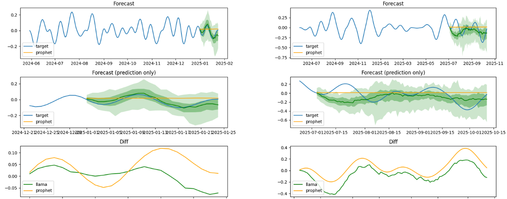

# Lag-Llama

My application for forecasting the Perlin noise using Lag-Llama.

使用Lag-llama的大模型进行时间序列预测，它是基于Transformer结构的时间序列预测大模型，并且在colab上提供了开源代码和预训练参数。我尝试让它对perlin噪声数据进行zero-shot的预测，分析 思路和预测结果如下。

- 首先，虽然perlin数据是噪声，但它仿佛具有一定规律，即它的octave参数控制着随机的振荡周期。我希望大模型能够抓住这种规律，根据蓝色部分将绿色部分预测出来。
- 其次，perlin数据归根结底还是噪声，因此我并不指望模型能够准确预测出后续时间序列，仅仅是希望它预测出的数据像是这组数据的后续即可。
- 另外，为了对比大模型的效果，我还使用了prophet包作为对比（下图中的橙黄色线）。

下图是两个典型结果，首先左图展示了预测成功的效果，即绿色曲线与蓝色曲线贴合得很好；右图展示了预测失败的效果，即绿色曲线与蓝色曲线差距较大。但即使如此，绿色线与蓝色线在断点处仍然是连续的，并且保持了一定的振荡。而它没有与蓝色线贴近的原因可能是由于这组蓝色线中间有平缓的一段，这导致模型无法判断使用观测数据中的哪些部分进行预测。

另外，prophet包预测结果几乎为水平直线，代表这类方法难以识别信号的振荡规律，反观大模型则找到了振荡的规律。因此，这是比较合理的结果。


[colab - LagLlama](https://colab.research.google.com/drive/1DRAzLUPxsd-0r8b-o4nlyFXrjw_ZajJJ?usp=sharing#scrollTo=vT93Ks5tSvzq)

[time-series-foundation-models/Lag-Llama · Hugging Face](https://huggingface.co/time-series-foundation-models/Lag-Llama)

---

# Lag-Llama: Towards Foundation Models for Probabilistic Time Series Forecasting


Lag-Llama is the <b>first open-source foundation model for time series forecasting</b>!

[[Tweet Thread](https://twitter.com/arjunashok37/status/1755261111233114165)] 

[[Model Weights](https://huggingface.co/time-series-foundation-models/Lag-Llama)] [[Colab Demo 1: Zero-Shot Forecasting](https://colab.research.google.com/drive/1DRAzLUPxsd-0r8b-o4nlyFXrjw_ZajJJ?usp=sharing)] [[Colab Demo 2: (Preliminary Finetuning)](https://colab.research.google.com/drive/1uvTmh-pe1zO5TeaaRVDdoEWJ5dFDI-pA?usp=sharing)]

[[Paper](https://arxiv.org/abs/2310.08278)]

[[Video](https://www.youtube.com/watch?v=Mf2FOzDPxck)]
____

<b>Updates</b>:

* **16-Apr-2024**: Released pretraining and finetuning scripts to replicate the experiments in the paper. See [Reproducing Experiments in the Paper](https://github.com/time-series-foundation-models/lag-llama?tab=readme-ov-file#reproducing-experiments-in-the-paper) for details.
* **9-Apr-2024**: We have released a 15-minute video 🎥 on Lag-Llama on [YouTube](https://www.youtube.com/watch?v=Mf2FOzDPxck).
* **5-Apr-2024**: Added a [section](https://colab.research.google.com/drive/1DRAzLUPxsd-0r8b-o4nlyFXrjw_ZajJJ?authuser=1#scrollTo=Mj9LXMpJ01d7&line=6&uniqifier=1) in Colab Demo 1 on the importance of tuning the context length for zero-shot forecasting. Added a [best practices section](https://github.com/time-series-foundation-models/lag-llama?tab=readme-ov-file#best-practices) in the README; added recommendations for finetuning. These recommendations will be demonstrated with an example in [Colab Demo 2](https://colab.research.google.com/drive/1uvTmh-pe1zO5TeaaRVDdoEWJ5dFDI-pA?usp=sharing) soon.
* **4-Apr-2024**: We have updated our requirements file with new versions of certain packages. Please update/recreate your environments if you have previously used the code locally.
* **7-Mar-2024**: We have released a preliminary [Colab Demo 2](https://colab.research.google.com/drive/1uvTmh-pe1zO5TeaaRVDdoEWJ5dFDI-pA?usp=sharing) for finetuning. Please note this is a preliminary tutorial. We recommend taking a look at the best practices if you are finetuning the model or using it for benchmarking.
* **17-Feb-2024**: We have released a new updated [Colab Demo 1](https://colab.research.google.com/drive/1DRAzLUPxsd-0r8b-o4nlyFXrjw_ZajJJ?usp=sharing) for zero-shot forecasting that shows how one can load time series of different formats.
* **7-Feb-2024**: We released Lag-Llama, with open-source model checkpoints and a Colab Demo for zero-shot forecasting.

____

**Current Features**:

💫 <b>Zero-shot forecasting</b> on a dataset of <b>any frequency</b> for <b>any prediction length</b>, using <a href="https://colab.research.google.com/drive/1DRAzLUPxsd-0r8b-o4nlyFXrjw_ZajJJ?usp=sharing" target="_blank">Colab Demo 1.</a><br/>

💫 <b>Finetuning</b> on a dataset using [Colab Demo 2](https://colab.research.google.com/drive/1uvTmh-pe1zO5TeaaRVDdoEWJ5dFDI-pA?usp=sharing).

💫 <b>Reproducing</b> experiments in the paper using the released scripts. See [Reproducing Experiments in the Paper](https://github.com/time-series-foundation-models/lag-llama?tab=readme-ov-file#reproducing-experiments-in-the-paper) for details. 

**Note**: Please see the [best practices section](https://github.com/time-series-foundation-models/lag-llama?tab=readme-ov-file#best-practices) when using the model for zero-shot prediction and finetuning.

____

## Reproducing Experiments in the Paper

To replicate the pretraining setup used in the paper, please see [the pretraining script](scripts/pretrain.sh). Once a model is pretrained, instructions to finetune it with the setup in the paper can be found in [the finetuning script](scripts/finetune.sh).


## Best Practices

Here are some general tips in using Lag-Llama. 
<!-- We recommend reading the [paper](https://arxiv.org/abs/2310.08278) for all details about the model. -->

### General Information

* Lag-Llama is a **probabilistic** forecasting model trained to output a probability distribution for each timestep to be predicted. For your own specific use-case, we would recommend benchmarking the zero-shot performance of the model on your data first, and then finetuning if necessary. As we show in our paper, Lag-Llama has strong zero-shot capabilities, but performs best when finetuned. The more data you finetune on, the better. For specific tips on applying on model zero-shot or on finetuning, please refer to the sections below.

#### Zero-Shot Forecasting

* Importantly, we recommend trying different **context lengths** (starting from $32$ which it was trained on) and identifying what works best for your data. As we show in [this section of the zero-shot forecasting demo](https://colab.research.google.com/drive/1DRAzLUPxsd-0r8b-o4nlyFXrjw_ZajJJ?authuser=1#scrollTo=Mj9LXMpJ01d7&line=6&uniqifier=1), the model's zero-shot performance improves as the context length is increased, until a certain context length which may be specific to your data. Further, we recommend enabling RoPE scaling for the model to work well with context lengths larger than what it was trained on.

#### Fine-Tuning

If you are trying to **benchmark** the performance of the model under finetuning, or trying to obtain maximum performance from the model: 

* We recommend tuning two important hyperparameters for each dataset that you finetune on: the **context length** (suggested values: $32$, $64$, $128$, $256$, $512$, $1024$) and the **learning rate** (suggested values: $10^{-2}$, $5 * 10^{-3}$, $10^{-3}$, $5 * 10^{-3}$, $1 * 10^{-4}$, $5 * 10^{-4}$). 
* We also highly recommend using a validation split of your dataset to early stop your model, with an early stopping patience of 50 epochs. 

## Contact

We are dedicated to ensuring the reproducility of our results, and would be happy to help clarify questions about benchmarking our model or about the experiments in the paper.
The quickest way to reach us would be by email. Please email **both**: 
1. [Arjun Ashok](https://ashok-arjun.github.io/) - arjun [dot] ashok [at] servicenow [dot] com
2. [Kashif Rasul](https://scholar.google.de/citations?user=cfIrwmAAAAAJ&hl=en) - kashif [dot] rasul [at] gmail [dot] com

If you have questions about the model usage (or) code (or) have specific errors (eg. using it with your own dataset), it would be best to create an issue in the GitHub repository.

## Citing this work

Please use the following Bibtex entry to cite Lag-Llama.

```
@misc{rasul2024lagllama,
      title={Lag-Llama: Towards Foundation Models for Probabilistic Time Series Forecasting}, 
      author={Kashif Rasul and Arjun Ashok and Andrew Robert Williams and Hena Ghonia and Rishika Bhagwatkar and Arian Khorasani and Mohammad Javad Darvishi Bayazi and George Adamopoulos and Roland Riachi and Nadhir Hassen and Marin Biloš and Sahil Garg and Anderson Schneider and Nicolas Chapados and Alexandre Drouin and Valentina Zantedeschi and Yuriy Nevmyvaka and Irina Rish},
      year={2024},
      eprint={2310.08278},
      archivePrefix={arXiv},
      primaryClass={cs.LG}
}
```


